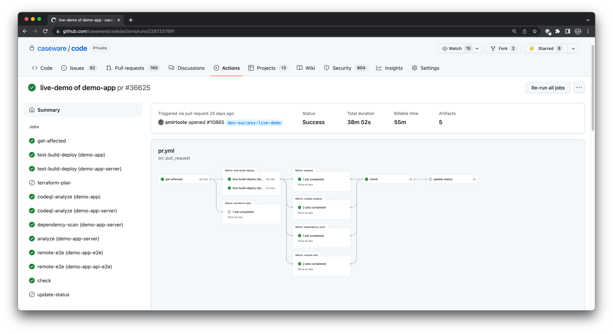

# Welcome to CaseWare's GitHub! 👋

CaseWare is one of Canada's original Fintech companies, having led the global audit and accounting software industry for over 30 years, with more than 500,000 users across 130 countries and available in 16 different languages.

# How we develop and deploy 🚀

Our Cloud applications are primarily developed and deployed through an organization-wide monorepo.

Our latest SDLC provides us with:
- pull-requests deployments for all affected apps
- automated e2e (A/B) tests for frontend and backend applications

